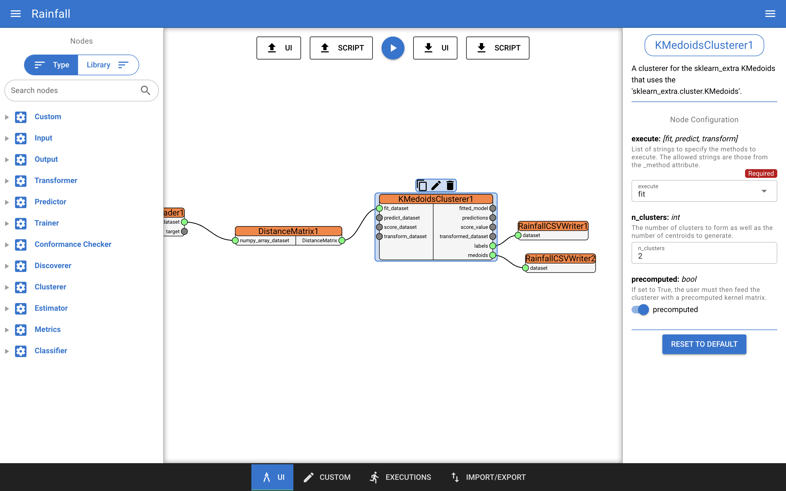

[](https://www.gnu.org/licenses/gpl-3.0)

# Rainfall

Rainfall allows a data scientist, even a non-expert programmer, to graphically setup a DataFlow node by node, as well as configuring each of them. From the web application user interface it is possible to create new custom nodes thanks to an integrated editor and also start the execution of a DataFlow, while looking at the progress and the logs produced.

This document includes:
- the steps for installing a local deployment of the framework;
- an overview of the web application user interface;
- one use case involving process mining analysis;
- one use case involving machine learning analysis.

More details can be found at [https://pros.unicam.it/rainfall](https://pros.unicam.it/rainfall). 

## Installation

Clone the git repository in a local folder using 

`git clone git@bitbucket.org:proslabteam/rainfall_unicam.git`

and then run

`docker-compose up -d --build`

This command will pull both the [Rainfall](https://hub.docker.com/r/proslabunicam/Rainfall) and the [Rainfall Worker](https://hub.docker.com/r/proslabunicam/Rainfall_worker) Docker images from DockerHub and start the application locally. 

Rainfall should now be accessible at [http://localhost:5000](http://localhost:5000).

## Docker

In order to use a Docker image for instantiating a container you need to download [Docker Desktop](https://www.docker.com/products/docker-desktop/) by choosing the right one for your OS. When you deal with Docker it should be clear that a container is isolated from the local host.

Rainfall and Rainfall Worker Docker images are available in [DockerHub](https://hub.docker.com/r/proslabunicam) or can be locally built using the Dockerfile and Dockerfile.worker, respectively, using the `docker build` command. 

For troubleshooting, check out [Docker official documentation](https://docs.docker.com/).

## Web application overview

### Canvas
The main canvas is where the user can compose a pipeline by simply drag-and-dropping nodes from the left drawer and configure them using the right one. The play button displayed at the top of the canvas is used to launch an execution. From this page, the user can also import/export a pipeline in the form of a Python script or a JSON file representing the canvas state.



### Custom node editor
The custom node editor allows to define new Python nodes that can be used right away in the definition of a pipeline. Once a custom node is defined and saved, the user can access it from the canvas page in the same way it the same way the built-in nodes are accessed. The custom node editor implements all the features that a common IDE implements, such as syntax highligthing and code completion.


### Execution panel
The execution panel is where the user can monitor the ongoing and previews executions in real-time. For each execution instance, the current status is displayed. The user can then click on a specific execution and have a look at the produced logs, which are displayed on the right side of the page, and at a simplified representation of the pipeline.


### Import/export view
The import/export view has two main functions:
- Save and manage pipeline repositories
- Upload and manage local folders

#### Pipeline repositories
Pipeline repositories can be used to save the current pipeline configuration and share it with other users. When stored in a repository, a pipeline is tagged with a name and can be later uploaded in the canvas for further configuration or exported locally.

#### Local folders
Local folders are used by Rainfall to manage small (<10Mb) local `.csv` or `.xes` files uploaded by the user or produced by a pipeline. Both folders and files have a unique ID that can be copied by the user and used to configure nodes that read local files, such as the `RainfallCSVLoader`, or that write to local folders, such as the `RainfallCSVWriter`. This feature is intended to give the user freedom to test new nodes on small datasets, without having to connect to remote data sources and sinks, and use Rainfall right away.


## Examples

### Inductive Miner Example

An example of a simple DataFlow is represented in the image below:


where:

- _RainfallXESLoader1_: loads a .xes file loaded in a Rainfall folder;
- _Pm4pyInductiveMiner1_: runs the Inductive Miner discovery algorithm implemented by the PM4PY Python library;
- _RainfallBPMNWriter1_: saves the resulting BPMN model in a Rainfall folder.

Once saved, the corresponding DataFlow is a Python script that looks like this:

```python
import rain as sr

df = sr.DataFlow("dataflow1")


RainfallXESLoader1 = sr.RainfallXESLoader(
    node_id="RainfallXESLoader1",
    file="file_name.xes" # change this!
)

Pm4pyInductiveMiner1 = sr.Pm4pyInductiveMiner(
    node_id="Pm4pyInductiveMiner1",
    activity_key="concept:name",
    timestamp_key="time:timestamp",
    case_id_key="case:concept:name",
)

RainfallBPMNWriter1 = sr.RainfallBPMNWriter(
    node_id="RainfallBPMNWriter1",
    name="result.bpmn",
    folder="rainfall_folder_id" # and this!
)


df.add_edges([
    RainfallXESLoader1 @ 'dataset' > Pm4pyInductiveMiner1 @ 'event_log',
    Pm4pyInductiveMiner1 @ 'model' > RainfallBPMNWriter1 @ 'model',
])

df.execute()
```

where:
- the Rain library is imported;
- the nodes are created and configured with their parameters;
- the nodes are connected.

Once the pipeline is created as shown above, it can be executed by pressing the play button located at the top of the canvas.


By doing so, the user will have to confirm the requirements (python libraries that are automatically identified by Rainfall) and the execution will finally start. The user will now be redirected to the execution panel where all the pipeline executions can be monitored in real-time.

At the end of the execution, the resulting BPMN model is saved in the Rainfall local folder specified by the user, where the source .xes file containing the event logs is also stored:


### KMedoids Clustering example

Another example, where both built-in nodes and custom nodes are used, is provided as follows,


where:

- _IrisDatasetLoader1_: loads the well-known Iris dataset;
- _DistanceMatrix1_: is a custom node that calculates the distance matrix using the imported _cdist()_ function;
- _KMedoidsClusterer1_: is a built-in node that runs the KMedoids clustering algorithm;
- _RainfallCSVWriter1_: saves the identified clusters in a Rainfall local folder;
- _RainfallCSVWriter2_: saves the identified medoids in a Rainfall local folder.

Once saved, the corresponding DataFlow is a Python script that looks like this:

```python
import rain as sr


def DistanceMatrix(inp, out, param='euclidean'):
    from scipy.spatial.distance import cdist
    X = inp['numpy_array_dataset']
    out['DistanceMatrix'] = cdist(X, X, metric=param)


df = sr.DataFlow("dataflow1")


IrisDatasetLoader1 = sr.IrisDatasetLoader(
    node_id="IrisDatasetLoader1",
    separate_target=False,
)

DistanceMatrix1 = sr.CustomNode(
    node_id="DistanceMatrix1",
    use_function=DistanceMatrix,
    param="euclidean",
)

KMedoidsClusterer1 = sr.KMedoidsClusterer(
    node_id="KMedoidsClusterer1",
    execute=['fit'],
    n_clusters=2,
    precomputed=True,
)

RainfallCSVWriter2 = sr.RainfallCSVWriter(
    node_id="RainfallCSVWriter2",
    folder_id="rainfall_folder_id", # change this!
    name="medoids.csv",
)

RainfallCSVWriter1 = sr.RainfallCSVWriter(
    node_id="RainfallCSVWriter1",
    folder_id="rainfall_folder_id", # and this!
    name="clusters.csv",
)


df.add_edges([
    DistanceMatrix1 @ 'DistanceMatrix' > KMedoidsClusterer1 @ 'fit_dataset',
    KMedoidsClusterer1 @ 'medoids' > RainfallCSVWriter2 @ 'dataset',
    KMedoidsClusterer1 @ 'labels' > RainfallCSVWriter1 @ 'dataset',
    IrisDatasetLoader1 @ 'dataset' > DistanceMatrix1 @ 'numpy_array_dataset',
])

df.execute()
```

where:
- the Rain library is imported;
- **the user-defined functions for the custom nodes are shown**;
- the nodes are created and configured with their parameters;
- the nodes are connected.

At the end of the execution, the resulting files are saved in the Rainfall local folder specified by the user:

